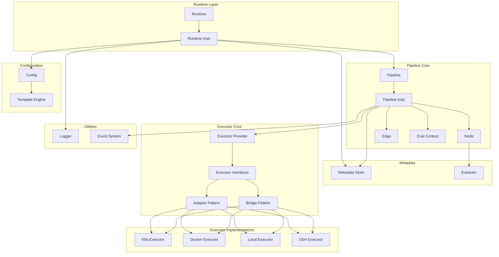

# PipelineX

<p align="center">
  
</p>

A flexible and extensible CI/CD pipeline execution library for Go, supporting multiple execution backends and DAG-based workflow orchestration.

[](https://golang.org)
[](LICENSE)

## Features

- **DAG-Based Workflow**: Define complex pipelines using Directed Acyclic Graph (DAG) structure with Mermaid syntax
- **Multi-Backend Execution**: Support for Local, Docker, and Kubernetes executors
- **Concurrent Execution**: Independent tasks run in parallel for optimal performance
- **Conditional Edges**: Dynamic execution paths with template-based condition expressions
- **Event-Driven Architecture**: Monitor pipeline lifecycle through event listeners
- **Template Engine**: Dynamic configuration rendering with Pongo2 templates
- **Metadata Management**: Process-safe metadata storage and retrieval
- **Log Streaming**: Real-time log output with customizable log pushing
- **Output Extraction**: Extract structured data from command output using codec-block or regex patterns
- **Runtime Recovery**: Resume pipeline execution from saved state
- **Data Passing**: Share data between nodes using metadata

## Installation

```bash
go get github.com/LerkoX/pipelinex
```

## Quick Start

```go
package main

import (
    "context"
    "fmt"
    "github.com/LerkoX/pipelinex"
)

func main() {
    ctx := context.Background()

    // Create runtime
    runtime := pipelinex.NewRuntime(ctx)

    // Pipeline configuration
    config := `
Version: "1.0"
Name: example-pipeline

Executors:
  local:
    type: local
    config:
      shell: bash

Graph: |
  stateDiagram-v2
    [*] --> Build
    Build --> Test
    Test --> [*]

Nodes:
  Build:
    executor: local
    steps:
      - name: build
        run: echo "Building..."
  Test:
    executor: local
    steps:
      - name: test
        run: echo "Testing..."
`

    // Execute pipeline synchronously
    pipeline, err := runtime.RunSync(ctx, "pipeline-1", config, nil)
    if err != nil {
        fmt.Printf("Pipeline failed: %v\n", err)
        return
    }

    fmt.Println("Pipeline completed successfully!")
}
```

## Output Extraction

PipelineX supports extracting structured data from command output and saving it to pipeline metadata for use in subsequent nodes.

### Codec-Block Extraction

Automatically recognizes and parses `pipelinex-json` and `pipelinex-yaml` code blocks:

```yaml
Nodes:
  Build:
    executor: local
    extract:
      type: codec-block
      maxOutputSize: 1048576  # Optional, default 1MB
    steps:
      - name: build
        run: |
          echo "Building..."
          echo '```pipelinex-json'
          echo '{"buildId": "12345", "version": "1.0.0"}'
          echo '```'
```

This extracts `buildId` and `version` from output and makes them available as `${Metadata.Build.buildId}` and `${Metadata.Build.version}`.

### Regex Extraction

Extract data using regular expressions:

```yaml
Nodes:
  Test:
    executor: local
    extract:
      type: regex
      patterns:
        coverage: "coverage: (\\d+\\.\\d+)%"
        tests: "(\\d+) tests? passed"
      maxOutputSize: 524288
    steps:
      - name: test
        run: go test -cover
```

This extracts test coverage and count from command output.

## Configuration

PipelineX uses YAML configuration with the following structure:

```yaml
Version: "1.0"              # Configuration version
Name: my-pipeline           # Pipeline name

Metadate:                   # Metadata configuration
  type: in-config           # Store type: in-config, redis, http
  data:
    key: value

Param:                      # Pipeline parameters
  buildId: "123"
  branch: "main"

Executors:                  # Global executor definitions
  local:
    type: local
    config:
      shell: bash
      workdir: /tmp

  docker:
    type: docker
    config:
      registry: docker.io
      network: host
      volumes:
        - /var/run/docker.sock:/var/run/docker.sock

Graph: |                    # DAG definition (Mermaid stateDiagram-v2)
  stateDiagram-v2
    [*] --> Build
    Build --> Test
    Test --> Deploy
    Deploy --> [*]

Nodes:                      # Node definitions
  Build:
    executor: local
    steps:
      - name: build
        run: go build .

  Test:
    executor: docker
    image: golang:1.21
    steps:
      - name: test
        run: go test ./...
```

## Executors

### Local Executor
Executes commands on the local machine.

```yaml
Executors:
  local:
    type: local
    config:
      shell: bash          # Shell to use (bash, sh, zsh)
      workdir: /tmp        # Working directory
      env:                 # Environment variables
        KEY: value
      ptimeout: "30s"      # Command timeout
      pty: true            # Enable PTY for interactive programs
```

### Docker Executor
Executes commands inside Docker containers.

```yaml
Executors:
  docker:
    type: docker
    config:
      registry: docker.io   # Image registry
      network: host         # Network mode
      workdir: /app         # Container working directory
      tty: true             # Enable TTY
      ttyWidth: 120         # TTY width
      ttyHeight: 40         # TTY height
      volumes:              # Volume mounts
        - /host/path:/container/path
      env:                  # Environment variables
        GO_VERSION: "1.21"
```

### Kubernetes Executor
Executes commands inside Kubernetes pods.

```yaml
Executors:
  k8s:
    type: k8s
    config:
      namespace: default
      serviceAccount: pipeline-sa
      podReadyTimeout: "60s"  # Pod ready timeout
```

## Conditional Edges

Define conditional execution paths using template expressions:

```yaml
Graph: |
  stateDiagram-v2
    [*] --> Build
    Build --> Deploy: "{{ eq .Param.branch 'main' }}"
    Build --> Test: "{{ ne .Param.branch 'main' }}"
    Test --> [*]
    Deploy --> [*]
```

Complex conditions are supported:

```yaml
# Multiple conditions
QualityCheck --> DeployStaging: "{{ QualityCheck.allTestsPassed == true and QualityCheck.codeCoverage >= 80 }}"

# Nested conditions
Deploy --> Production: "{{ eq .Param.environment 'production' and .ManualApproval.approved == true }}"
```

## Data Passing

Share data between nodes using metadata:

```yaml
Nodes:
  Generate:
    executor: local
    steps:
      - name: generate
        run: |
          echo '```pipelinex-json'
          echo '{"value": 42, "message": "hello world"}'
          echo '```'
    extract:
      type: codec-block

  Process:
    executor: local
    steps:
      - name: process
        run: |
          echo "Processing value: {{ .Metadata.Generate.value }}"
          echo "Message: {{ .Metadata.Generate.message }}"
```

## Runtime Recovery

Resume pipeline execution from saved state:

```yaml
Nodes:
  Build:
    executor: local
    runtime:                    # Node runtime status for recovery
      status: "SUCCESS"         # Already completed, will be skipped
      startTime: "2026-03-30T10:00:00Z"
      endTime: "2026-03-30T10:01:00Z"
      steps:
        - name: build
          status: "SUCCESS"
          output: "Build completed"
    steps:
      - name: build
        run: echo "Building..."

  Test:
    executor: local
    runtime:                    # Node runtime status for recovery
      status: "PENDING"         # Will execute
    steps:
      - name: test
        run: echo "Testing..."
```

## Event Monitoring

Monitor pipeline execution through event listeners:

```go
listener := pipelinex.NewListener()
listener.Handle(func(p pipelinex.Pipeline, event pipelinex.Event) {
    switch event {
    case pipelinex.PipelineInit:
        fmt.Println("Pipeline initialized")
    case pipelinex.PipelineStart:
        fmt.Println("Pipeline started")
    case pipelinex.PipelineFinish:
        fmt.Println("Pipeline finished")
    case pipelinex.PipelineExecutorPrepare:
        fmt.Println("Executor preparing")
    case pipelinex.PipelineNodeStart:
        fmt.Println("Node started")
    case pipelinex.PipelineNodeFinish:
        fmt.Println("Node completed")
    }
})

pipeline, err := runtime.RunSync(ctx, "id", config, listener)
```

## Architecture



## Examples

See [examples/workflows/README.md](./examples/workflows/README.md) for detailed workflow examples:

- **File Processing**: Automated log archiving and cleanup
- **Data ETL**: Parallel data collection and transformation
- **CI/CD Deployment**: Complete deployment pipeline with quality gates
- **Weather Notification**: Weather API integration with messaging

## API Reference

### Runtime

```go
type Runtime interface {
    Get(id string) (Pipeline, error)                          // Get pipeline by ID
    Cancel(ctx context.Context, id string) error              // Cancel running pipeline
    RunAsync(ctx context.Context, id string, config string, listener Listener) (Pipeline, error)  // Async execution
    RunSync(ctx context.Context, id string, config string, listener Listener) (Pipeline, error)   // Sync execution
    Rm(id string)                                             // Remove pipeline record
    Done() chan struct{}                                      // Runtime completion signal
    Notify(data interface{}) error                            // Notify runtime
    Ctx() context.Context                                     // Get runtime context
    StopBackground()                                          // Stop background processing
    StartBackground()                                         // Start background processing
    SetPusher(pusher Pusher)                                  // Set log pusher
    SetTemplateEngine(engine TemplateEngine)                  // Set template engine
}
```

### Pipeline

```go
type Pipeline interface {
    Run(ctx context.Context) error                            // Run pipeline
    Cancel()                                                  // Cancel pipeline
    Done() chan struct{}                                      // Pipeline completion signal
    SetGraph(graph Graph)                                     // Set DAG graph
    GetGraph() Graph                                          // Get DAG graph
    SetExecutorProvider(provider ExecutorProvider)            // Set executor provider
    Listening(listener Listener)                              // Set event listener
    SetMetadata(metadata MetadataStore)                       // Set metadata store
    Id() string                                                // Get pipeline ID
    Status() string                                             // Get pipeline status
    Metadata() map[string]any                                 // Get pipeline metadata
}
```

## Testing

```bash
go test ./...
```

## Contributing

Contributions are welcome! Please feel free to submit a Pull Request.

## License

MIT License - see [LICENSE](LICENSE) for details.

[中文文档](./README_ZH.md)
