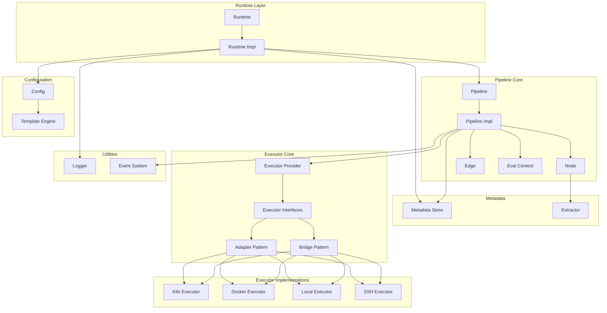

# PipelineX

<p align="center">
  
</p>

一个灵活且可扩展的 Go 语言 CI/CD 流水线执行库，支持多种执行后端和基于 DAG 的工作流编排。

[](https://golang.org)
[](LICENSE)

## 特性

- **DAG 工作流**：使用 Mermaid 语法定义复杂的流水线有向无环图结构
- **多后端执行**：支持本地、Docker 和 Kubernetes 执行器
- **并发执行**：独立任务并行运行以获得最佳性能
- **条件边**：使用模板表达式实现动态执行路径
- **事件驱动架构**：通过事件监听器监控流水线生命周期
- **模板引擎**：使用 Pongo2 模板进行动态配置渲染
- **元数据管理**：进程安全的元数据存储和检索
- **日志流式传输**：实时日志输出，支持自定义日志推送
- **输出提取**：支持通过代码块或正则表达式从命令输出提取结构化数据
- **运行时恢复**：支持从保存状态恢复流水线执行
- **数据传递**：节点间通过元数据共享数据

## 安装

```bash
go get github.com/LerkoX/pipelinex
```

## 快速开始

```go
package main

import (
    "context"
    "fmt"
    "github.com/LerkoX/pipelinex"
)

func main() {
    ctx := context.Background()

    // 创建运行时
    runtime := pipelinex.NewRuntime(ctx)

    // 流水线配置
    config := `
Version: "1.0"
Name: example-pipeline

Executors:
  local
    type: local
    config:
      shell: bash

Graph: |
  stateDiagram-v2
    [*] --> Build
    Build --> Test
    Test --> [*]

Nodes:
  Build:
    executor: local
    steps:
      - name: build
        run: echo "Building..."
  Test:
    executor: local
    steps:
      - name: test
        run: echo "Testing..."
`

    // 同步执行流水线
    pipeline, err := runtime.RunSync(ctx, "pipeline-1", config, nil)
    if err != nil {
        fmt.Printf("流水线执行失败: %v\n", err)
        return
    }

    fmt.Println("流水线执行成功!")
}
```

## 输出提取

PipelineX 支持从命令输出提取结构化数据并保存到流水线元数据，供后续节点使用。

### Codec-Block 提取

自动识别并解析 `pipelinex-json` 和 `pipelinex-yaml` 代码块：

```yaml
Nodes:
  Build:
    executor: local
    extract:
      type: codec-block
      maxOutputSize: 1048576  # 可选，默认 1MB
    steps:
      - name: build
        run: |
          echo "Building..."
          echo '```pipelinex-json'
          echo '{"buildId": "12345", "version": "1.0.0"}'
          echo '```'
```

这将从输出中提取 `buildId` 和 `version`，使其可作为 `${Metadata.Build.buildId}` 和 `${Metadata.Build.version}` 使用。

### 正则表达式提取

使用正则表达式提取数据：

```yaml
Nodes:
  Test:
    executor: local
    extract:
      type: regex
      patterns:
        coverage: "coverage: (\\d+\\.\\d+)%"
        tests: "(\\d+) tests? passed"
      maxOutputSize: 524288
    steps:
      - name: test
        run: go test -cover
```

这将从命令输出中提取测试覆盖率和测试数量。

## 配置说明

PipelineX 使用 YAML 配置，结构如下：

```yaml
Version: "1.0"              # 配置版本
Name: my-pipeline           # 流水线名称

Metadate:                   # 元数据配置
  type: in-config           # 存储类型：in-config, redis, http
  data:
    key: value

Param:                      # 流水线参数
  buildId: "123"
  branch: "main"

Executors:                  # 全局执行器定义
  local:
    type: local
    config:
      shell: bash
      workdir: /tmp

  docker:
    type: docker
    config:
      registry: docker.io
      network: host
      volumes:
        - /var/run/docker.sock:/var/run/docker.sock

Graph: |                    # DAG DAG 定义（Mermaid stateDiagram-v2 语法）
  stateDiagram-v2
    [*] --> Build
    Build --> Test
    Test --> Deploy
    Deploy --> [*]

Nodes:                      # 节点定义
  Build:
    executor: local
    steps:
      - name: build
        run: go build .

  Test:
    executor: docker
    image: golang:1.21
    steps:
      - name: test
        run: go test ./...
```

## 执行器

### 本地执行器
在本地机器上执行命令。

```yaml
Executors:
  local:
    type: local
    config:
      shell: bash          # 使用的 Shell（bash, sh, zsh）
      workdir: /tmp        # 工作目录
      env:                 # 环境变量
        KEY: value
      timeout: "30s"       # 命令超时时间
      pty: true            # 启用 PTY 支持交互式程序
```

### Docker 执行器
在 Docker 容器内执行命令。

```yaml
Executors:
  docker:
    type: docker
    config:
      registry: docker.io   # 镜像仓库
      network: host         # 网络模式
      work: /app          # 容器内工作目录
      tty: true             # 启用 TTY
      ttyWidth: 120         # TTY 宽度
      ttyHeight: 40         # TTY 高度
      volumes:              # 卷挂载
        - /host/path:/container/path
      env:                  # 环境变量
        GO_VERSION: "1.21"
```

### Kubernetes 执行器
在 Kubernetes Pod 内执行命令。

```yaml
Executors:
  k8s:
    type: k8s
    config:
      namespace: default
      serviceAccount: pipeline-sa
      podReadyTimeout: "60s"  # Pod 就绪等待超时
```

## 条件边

使用模板表达式定义条件执行路径：

```yaml
Graph: |
  stateDiagram-v2
    [*] --> Build
    Build --> Deploy: "{{ eq .Param.branch 'main' }}"
    Build --> Test: "{{ ne .Param.branch 'main' }}"
    Test --> [*]
    Deploy --> [*]
```

支持复杂条件：

```yaml
# 多条件
QualityCheck --> DeployStaging: "{{ QualityCheck.allTestsPassed == true and QualityCheck.codeCoverage >= 80 }}"

# 嵌套条件
Deploy --> Production: "{{ eq .Param.environment 'production' and .ManualApproval.approved == true }}"
```

## 数据传递

通过元数据在节点间共享数据：

```yaml
Nodes:
  Generate:
    executor: local
    steps:
      - name: generate
        run: |
          echo '```pipelinex-json'
          echo '{"value": 42, "message": "hello world"}'
          echo '```'
    extract:
      type: codec-block

  Process:
    executor: local
    steps:
      - name: process
        run: |
          echo "Processing value: {{ .Metadata.Generate.value }}"
          echo "Message: {{ .Metadata.Generate.message }}"
```

## 运行时恢复

如果流水线执行失败，可以记录节点状态以便下次恢复：

```yaml
Status:
  Build: SUCCESS        # 已完成，会被跳过
  Test: PENDING          # 会执行

Nodes:
  Build:
    # ... 节点配置
  Test:
    # ... 节点配置
```

## 事件监控

通过事件监听器监控流水线执行：

```go
listener := pipelinex.NewListener()
listener.Handle(func(p pipelinex.Pipeline, event pipelinex.Event) {
    switch event {
    case pipelinex.PipelineInit:
        fmt.Println("流水线初始化")
    case pipelinex.PipelineStart:
        fmt.Println("流水线开始")
    case pipelinex.PipelineFinish:
        fmt.Println("流水线完成")
    case pipelinex.PipelineExecutorPrepare:
        fmt.Println("执行器准备中")
    case pipelinex.PipelineNodeStart:
        fmt.Println("节点开始执行")
    case pipelinex.PipelineNodeFinish:
        fmt.Println("节点执行完成")
    }
})

pipeline, err := runtime.RunSync(ctx, "id", config, listener)
```

## 架构图



## 示例

查看 [examples/workflows/README.md](./examples/workflows/README.md) 了解详细的流水线示例：

- **文件处理**：自动化日志归档和清理
- **数据 ETL**：并行数据采集和转换
- **CI/CD 部署**：完整的部署流水线，包含质量门禁
- **天气通知**：天气 API 集成与消息通知


## API 参考

### Runtime

```go
type Runtime interface {
    Get(id string) (Pipeline, error)                          // 根据 ID 获取流水线
    Cancel(ctx context.Context, id string) error              // 取消运行中的流水线
    RunAsync(ctx context.Context, id string, config string, listener Listener) (Pipeline, error)  // 异步执行
    RunSync(ctx context.Context, id string, config string, listener Listener) (Pipeline, error)   // 同步执行
    Rm(id string)                                             // 移除流水线记录
    Done() chan struct{}                                      // 运行时完成信号
    Notify(data interface{}) error                            // 通知运行时
    Ctx() context.Context                                     // 获取运行时上下文
    StopBackground()                                          // 停止后台处理
    StartBackground()                                         // 启动后台处理
    SetPusher(pusher Pusher)                                  // 设置日志推送器
    SetTemplateEngine(engine TemplateEngine)                  // 设置模板引擎
}
```

### Pipeline

```go
type Pipeline interface {
    Run(ctx context.Context) error                            // 运行流水线
    Cancel()                                                  // 取消流水线
    Done() chan struct{}                                      // 流水线完成信号
    SetGraph(graph Graph)                                     // 设置 DAG 图
    GetGraph() Graph                                          // 获取 DAG 图
    SetExecutorProvider(provider ExecutorProvider)            // 设置执行器提供者
    Listening(listener Listener)                              // 设置事件监听器
    SetMetadata(metadata MetadataStore)                       // 设置元数据存储
    Id() string                                                // 获取流水线 ID
    Status() string                                             // 获取流水线状态
    Metadata() map[string]any                                 // 获取流水线元数据
}
```

## 测试

```bash
go test ./...
```

## 贡献

欢迎贡献！请随时提交 Pull Request。

## 许可证

MIT 许可证 - 详见 [LICENSE](LICENSE) 文件。

[English Documentation](./README.md)
